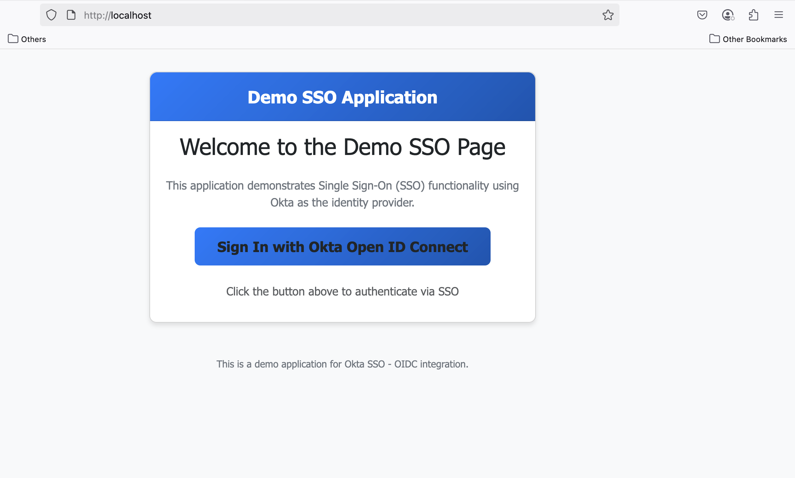

# Docker PHP App using Okta Demo

## Project Overview

I created an OIDC SSO framework from an existing PHP application. This project demonstrates how to implement Single Sign-on using Okta's OpenID Connect.

This PHP application was cloned from an existing repository, and I implemented the OIDC framework on top of it.
It's a simple website enhanced with SSO functionality, allowing routing rules for Entra ID users.

This web application works with Docker and runs locally on your machine.

## Goal

Create a basic PHP app that uses the Okta service for authentication (authN).

**Reference:** [Okta Article: Build a Simple PHP App with Authentication](https://developer.okta.com/blog/2018/07/09/five-minute-php-app-auth)

## Setup Instructions

### Okta Configuration

1. Go to [Okta Developer Portal](https://developer.okta.com/) and sign in (create an account if needed)
2. Navigate to Applications > Applications > Create app integration
3. Choose OIDC, then select Web App, and click Next
4. Name the app and set sign-in redirect URI: `http://localhost:80/` (include the http and the trailing / character)
5. Do the same for the sign-out redirect URI: `http://localhost:80/`
6. Under Assignments, allow everyone in your org to access

### Configuration Details

7. Copy the Client ID: `xxxxx`
8. Copy the Client Secret: `xxxxxxxxx`
9. Make note of your Okta Org URL (found in the URL of your Okta developer page, e.g., `https://dev-96447452-admin.okta.com/`)
10. Modify the values for the client ID, secret, and Okta Org in the `index.php` file

### Running the Application

1. Run command: `docker-compose up` from the project repository
2. Access the application at: `http://localhost:80`

> **Note:** If you encounter errors, ensure that Docker is running on your local machine.

